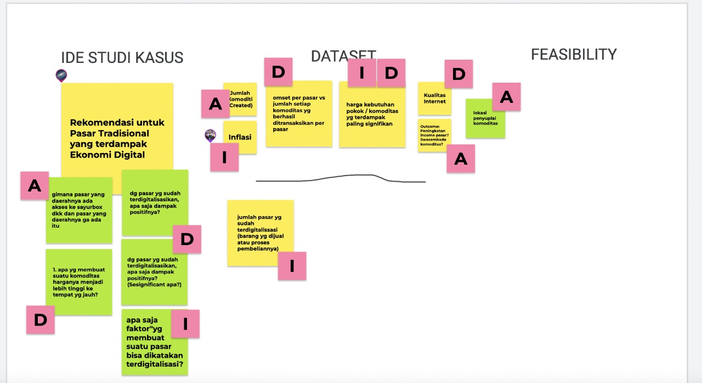

# Logbook

## 20221112

### Dataset 

Ketemu beberapa data yang menarik untuk dilihat:
- [BPS: Produksi Tanaman Perkebunan](https://jabar.bps.go.id/indicator/163/312/1/produksi-tanaman-perkebunan.html)
- [Jabarprov: Produksi Sayuran Berdasarkan Komoditas](https://opendata.jabarprov.go.id/id/dataset/produksi-sayuran-berdasarkan-komoditas-di-jawa-barat)
- [Bappelitbangda: Kajian Pengembangan Potensi Pasar Tradisional Di Kabupaten Purwakarta](https://bappelitbangda.purwakartakab.go.id/assets/upload/kajian/d4e93a67281409e2bcad7b62364ca810.pdf)
  - TBD
- [Stymikpn: Survei Omzet Pedagang Pasar Kabupaten Sleman](http://stimykpn.ac.id/storage/penelitian/penelitian-1615798497.pdf)
  - Survey ini hanya mencakup satu kabupaten, namun metodologi yang digunakan dan angka luarannya bisa digunakan untuk mengestimasi kondisi di daerah lain. Misalnya bisa dilihat juga berdasarakan buying power di suatu daerah dan juga [peta harga barang pokok](https://satudata.kemendag.go.id/data-informasi/harga-komoditas/peta-harga-barang-pokok) dari kemendag.
- [Kemendag: Jumlah Uang Beredar](https://satudata.kemendag.go.id/data-informasi/perdagangan-dalam-negeri/jumlah-uang-beredar)
  - Data ini menarik dilihat dengan point of view bahwa jika peredaran uang kartal berkurang, hal tersebut bisa mengancam kondisi pasar tradisional yang belum beralih ke digital. Data ini bisa dibarengi dengan penggunaan QRIS berdasarkan wilayah dan bila memungkinkan demografi ekonominya. Untuk memperkaya analisis ini bisa lihat juga [report dari BI untuk Jawa Barat](https://www.bi.go.id/id/publikasi/laporan/lpp/Documents/Laporan-Perekonomian-Provinsi-Jawa-Barat-Agustus-2021.pdf).

### Riset dan Metode

Dan jadi kepikiran juga soal gimana sih efek dari pasar tradisional yang digital (tokopedia) ke omset pasar tersebut. Ini bisa dilihat misal kita cari pasar tradisional yang di Sleman tapi di tokopedia, dan lihat omset di bulan ini teh berapa. Tapi jangan lupa untuk *consider* juga [efek dari modern retail](https://papers.ssrn.com/sol3/papers.cfm?abstract_id=2345170) ke pasar, terutama di akhir2 ini juga kayak indomart dan borma mulai jadi opsi juga untuk cari bahan pokok

Soal komoditas apa aja yang kita amatin, kita bisa cari komoditas yang berupa bahan pokok yang emang pada dasaranya merupakan alasan adanya pasar dan biar lebih fokus analisisnya. Untuk apa aja bahan pokok tsb bisa refer ke data kemendag tadi yang peta harga barang pokok. Dan untuk lihat apakah harga suatu daerah itu normal atau ga (misal dari [EWS](https://ews.kemendag.go.id/), [hargapangan](https://hargapangan.id/tabel-harga/pasar-tradisional/komoditas) atau BPS(yang ini ga nemu refnya))

Soal *what can be done* bisa refer ke [case study revitalization](http://eprints.undip.ac.id/63570/1/s35.compressed.pdf) yang argue ada beberapa level yang bisa dilakuin untuk ngarahin revitalisasi. Sedangkan untuk yang lebih actionable bisa juga lihat di [Case Study Cisalak Market](http://www.internationaljournalcorner.com/index.php/theijbm/article/view/151283/105476) untuk bisa lihat kira-kira faktor apa aja yang bisa dikembangin. Untuk urgensi bisa dilihat juga di riset [food integrationnya world bank](https://documents1.worldbank.org/curated/en/571211554282494629/pdf/Food-Market-Integration-and-Price-Differential-Across-Provinces-in-Indonesia.pdf) yang argue bahwa harga yang tinggi berkorelasi dengan daerah yang miskin dan undernutritioned. 

Terus penasaran yang disebut sama pasar modern teh apa, dan apakah ada perbedaan performa dibandingkan pasar tradisional?

### Swasembada Komoditas

Untuk swasembada sendiri, mungkin bisa mulai dari kebutuhan dan produksi bahan pokok di Jawa Barat kayak gimana dan coba ditarik ke populasi ya, biar bisa lihat kira2 butuh sebanyak apalagi. Dan masih bingung juga menentukkan kecocokan suatu daerah untuk dipakai sebagai produsen suatu komoditas teh gimana. Kayaknya akan beda-beda tiap komoditas, apa udah ada yang pernah bikin kayak gini ya?

### 

## 20221112

Meeting with Diar and Ipul resulting in the following diagram for work division

Overall we're planning on using data from west java to find out how digitalization affect traditional market, and is there anything that we can do for it?

> TODO:
> - [ ] Commodity Created per Cities and if possible also the trade between cities
> - [ ] How swasembada commodity works
> - [ ] 